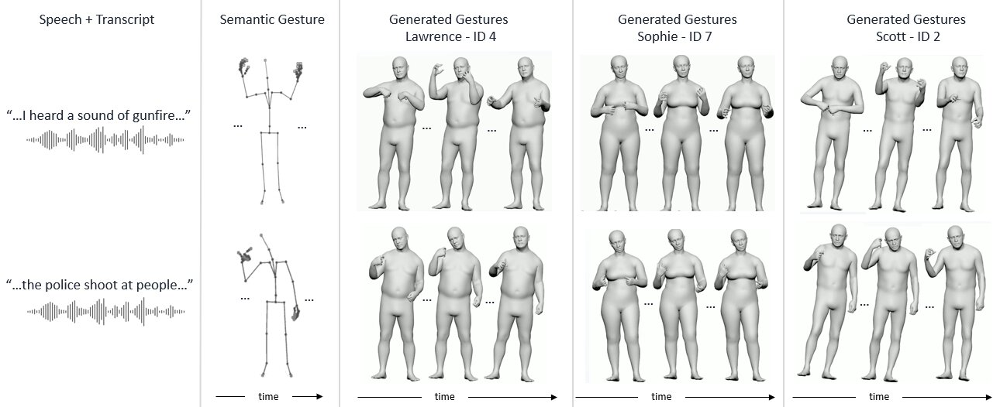

<h1 align="center">
  SiGnature: Explicit Motion Diffusion for Stylized Semantic Gesture Generation <br> [SCA 2026]
</h1>

<p align='center'>
<a href="https://adirosenthal540.github.io/SiGnature_web/"></a>
<a href="https://www.youtube.com/watch?v=D5cy8M1RekU"></a>
<a href="https://arxiv.org/abs/2606.15889"></a>
</p>


This is the official repository of the paper **"SiGnature: Explicit Motion Diffusion for Stylized Semantic Gesture Generation"** by Adi Rosenthal, Tomer Koren, Nadav Shaked, Doron Friedman, and Ariel Shamir.




## Getting started

This code was tested on `Ubuntu 18.04.5 LTS` and requires:

* Python 3.12
* conda3 or miniconda3
* CUDA capable GPU 24G (one is enough)

### 1. Setup environment

Setup conda env:
```shell
conda create -n signature python=3.12
conda activate signature
pip install "setuptools<81"
pip install -r requirements.txt
```

`requirements.txt` pins `torch`/`torchvision`. If you need a build for a specific CUDA version, install them first following the [official PyTorch instructions](https://pytorch.org/get-started/locally/), then run `pip install -r requirements.txt`.

Install ffmpeg (if not already installed):

```shell
conda install -n signature -c conda-forge "ffmpeg=6.1.1=gpl*"
```

For windows use [this](https://www.geeksforgeeks.org/how-to-install-ffmpeg-on-windows/) instead.

Download dependencies:

<details>
  <summary><b>Base Models</b></summary>

```bash
bash prepare/download_models.sh
bash prepare/download_hub.sh
```

This populates `./ckp/official_model/` (pretrained checkpoints) and `./datasets/hub/` (SMPL-X model files, matching `data_path_1` in `dataset/emage.yaml`).
</details>


### 2. Get data

All datasets live under `./datasets`. Create the directory (or a symlink to wherever you keep large datasets) first:

```bash
mkdir -p datasets
```

<details>
  <summary><b>BEAT2 motions</b></summary>

```bash
bash prepare/download_BEAT_SMPL.sh
bash prepare/download_semantic_texts.sh
```

This populates `./datasets/BEAT_SMPL/BEAT2/beat_english_v2.0.0/`, matching `data_path` in `dataset/emage.yaml`.
</details>

<details>
  <summary><b>Semantic motions (SeG)</b></summary>

```bash
bash prepare/download_SeG.sh
```

This populates `./datasets/SeG_SMPLX/`, used when sampling with `--use_seg true`.
</details>

### 3. Configure for your speaker

Before running the model, you need to configure the `dataset/emage.yaml` file to specify which speaker you want to train on or generate motions for:

**Training Speakers Configuration:**
- Edit the `training_speakers` field (line 22) to specify the speaker ID(s) you want to use
- Example: `training_speakers: [7]` for speaker ID 7, or `training_speakers: [1,2,3]` for multiple speakers
<!-- - Available speaker IDs: 1-30 (check your dataset for available speakers) -->

**Cache Directory Configuration:**
- Update the `cache_path` field (line 24) to match your speaker ID
- Example: `cache_path: datasets/beat_cache/id_7` for speaker ID 7
- The cache directory should correspond to the speaker you're training on
<!-- - If the cache doesn't exist, set `new_cache: True` to force creation of a new cache -->

**Important Cache Creation Notes:**
- **First-time cache creation**: When you run the model for the first time with a new cache directory, it will create the cache folder and process speakers data (from `training_speakers`) from your dataset
- **Do not interrupt**: The initial cache creation process can take a significant amount of time. **DO NOT interrupt this process** or the cache will be incomplete
- **If interrupted**: If the cache creation process gets interrupted or fails, the cache folder will be corrupted. In this case:
  1. Delete the entire cache folder (e.g., `rm -rf datasets/beat_cache/id_7`)
  2. Run the training/inference command again to restart the cache creation
- **Cache completion**: Only proceed with training once the cache creation is fully completed without errors

**Example configuration for speaker ID 7:**
```yaml
training_speakers: [7]
cache_path: datasets/beat_cache/id_7
new_cache: False
```

## Motion Synthesis

### Preprocess audio for inference

Before running inference on your own audio, preprocess it to generate transcripts and a semantic annotation template:

```shell
python -m sample.preprocess_audio --audio_path ./path/to/audio.wav
```

This generates three files next to the audio:
* `audio.TextGrid` — word-level time alignment (via Whisper)
* `audio.txt` — plain transcript
* `audio_semantic.txt` — template for SeG gesture annotation

To see available gesture codes:
```shell
python -m sample.preprocess_audio --audio_path ./path/to/audio.wav --list_gestures
```

Edit `audio_semantic.txt` to add inline gesture codes where desired:
```
the first thing (1231 FOREFINGER RAISE-ONE) i like to do on weekends...
```

When `audio_semantic.txt` exists next to the audio file, `sample.inference` will automatically detect it and enable SeG gesture injection.

### Generate from an audio file

```shell
python -m sample.inference \
  --model-path ./ckp/official_model/<checkpoint>.pt \
  --audio_path ./path/to/audio.wav \
  --handshake_size 30 --blend_len 10 \
  --config ./dataset/emage.yaml --dataset beat2 \
  --num_repetitions 1 --device 0 --guidance_param 1 \
  --diffusion_steps 100 --seed 12 --run_videos
```

You can also use `--person 2_scott` instead of `--model-path` to auto-resolve the model and cache paths.

On first run, a `.TextGrid` transcript is automatically generated next to the audio file.

### Generate from the test set (DoubleTake)

```shell
python -m sample.double_take_gestures \
  --model-path ./ckp/official_model/<checkpoint>.pt \
  --handshake_size 30 --blend_len 10 \
  --config ./dataset/emage.yaml --dataset beat2 \
  --num_repetitions 1 --device 0 --guidance_param 1 \
  --diffusion_steps 100 --seed 12 --run_videos
```

Or use `--person` to automatically resolve the model and dataset cache for a speaker:

```shell
python -m sample.double_take_gestures \
  --person 1_wayne \
  --handshake_size 30 --blend_len 10 \
  --config ./dataset/emage.yaml --dataset beat2 \
  --num_repetitions 1 --device 0 --guidance_param 1 \
  --diffusion_steps 100 --seed 12 --run_videos
```

`--person` accepts a folder name from `ckp/official_model/` (e.g. `1_wayne`) or just the person ID (e.g. `1`). It auto-resolves `--model-path` and sets the dataset `cache_path` to `id_<person_id>`.

This samples long-form sequences from the BEAT2 test split using the DoubleTake handshake/blend algorithm.

To run on **all identities** (with Whisper re-transcription):

```shell
for person in 1_wayne 2_scott 4_lawrence 7_sophie 21_ayana; do
  echo "=== Running $person ==="
  python -m sample.double_take_gestures \
    --person $person \
    --rewrite_textgrid \
    --handshake_size 30 --blend_len 10 \
    --config ./dataset/emage.yaml --dataset beat2 \
    --num_repetitions 1 --device 0 --guidance_param 1 \
    --diffusion_steps 100 --seed 12 --run_videos
done
```

> `--rewrite_textgrid` re-transcribes audio with Whisper during cache building. It only takes effect when the cache is being (re)built — if the cache already exists, add `--new_cache True` to force a rebuild.

**Common flags** (apply to both commands above):
* `--device <id>` — GPU index.
* `--seed <int>` — random seed; change to sample different sequences.
* `--guidance_param <float>` — classifier-free guidance scale (`1` disables it).
* `--diffusion_steps <int>` — number of denoising steps.
* `--run_videos` — also render an `.mp4` (with audio) alongside the `.npz` output.

## Motion Editing with Semantic Gestures (SeG)

```shell
python -m sample.double_take_gestures \
  --model-path ./ckp/official_model/<checkpoint>.pt \
  --handshake_size 30 --blend_len 10 \
  --config ./dataset/emage.yaml --dataset beat2 \
  --num_repetitions 1 --device 0 --use_seg true \
  --diffusion_steps 100 --run_videos
```

* `--use_seg true` injects semantic gestures from the SeG dataset (`prepare/download_SeG.sh`) into the generated motion.
* Optionally pass `-s ./dataset/guidance_config.yaml` (or your own copy) to customize the SeG guidance settings.
* Optionally pass `--static_pose_json <path/to/pose.json>` to anchor the sequence to a static reference pose.

With `--run_videos`, each avatar (benchmark, result, original generation) is rendered as a separate `.mp4`.

## Output format

`sample.inference` and `sample.double_take_gestures` write a `res_<name>.npz` file containing SMPL-X `betas`, `poses` (axis-angle), `expressions`, `trans`, `model` and `gender` fields, suitable for loading with [SMPL-X](https://smpl-x.is.tue.mpg.de/) for rendering or retargeting. With `--run_videos`, an `.mp4` rendering of the same sequence is saved alongside it.

## Train your own SiGnature

Make sure you've completed [Configure for your speaker](#3-configure-for-your-speaker) first.

**Fine-tune on BEAT2:**

```shell
python -m train.train_basemodel \
  --save-dir ./save/my_run \
  --dataset beat2 --overwrite --cond_mode true \
  --eval-split val --config ./dataset/emage.yaml \
  --batch-size 32 --device 0 \
  --train-platform-type WandbPlatform \
  --save-interval 1000 --val_during_training --lambda_fc 1000
```

* Use `--device` to set the GPU id.
* Use `--arch {trans_enc, trans_dec, gru}` to pick the model architecture (`trans_enc` is the default).
* Use `--train-platform-type {NoPlatform, WandbPlatform, TensorboardPlatform, ClearmlPlatform}` to choose where to log training curves.
* Add `--model-path <path/to/model####.pt>` to initialize training from an existing checkpoint.
<!-- * Add `--eval_during_training` to run a short evaluation pass on each saved checkpoint (slower, but gives better monitoring). -->

**Training from scratch with AMASS:**

1. Register and download the **SMPL-X** version of [AMASS](https://amass.is.tue.mpg.de/) and extract it to `./datasets/AMASS-SMPLX/` (or point `--data_amass_path` at a custom location).
2. Run:
   ```shell
   python -m train.train_basemodel \
     --save-dir ./save/amass_training \
     --dataset beat2 --overwrite --cond_mode true \
     --eval-split val --config ./dataset/emage.yaml \
     --batch-size 32 --device 0 \
     --train-platform-type WandbPlatform \
     --save-interval 1000 --val_during_training --use_amass
   ```

`--use_amass` combines AMASS with your primary (BEAT2) dataset during training.

**Re-transcribing TextGrids with Whisper:**

The BEAT2 dataset ships with word-level TextGrid transcriptions. If these are missing or you want to re-transcribe using Whisper, add `--rewrite_textgrid` to your training command:

```shell
python -m train.train_basemodel \
  --save-dir ./save/my_run \
  --dataset beat2 --overwrite --cond_mode true \
  --config ./dataset/emage.yaml --rewrite_textgrid \
  --batch-size 32 --device 0 \
  --train-platform-type WandbPlatform \
  --save-interval 1000 --val_during_training --lambda_fc 1000
```

This will:
1. Transcribe each audio file in `wave16k/` using Whisper
2. Save new TextGrids to `textgrid_whisper/` alongside the original `textgrid/` folder
3. Generate corresponding `.txt` transcript files in `texts_whisper/`
4. Use the new TextGrids for cache generation

The original `textgrid/` folder is never modified. Existing Whisper transcriptions in `textgrid_whisper/` are skipped, so you can safely re-run the command if interrupted.
<!-- 
## Evaluation -->

<!-- [`sample/run_evaluation.py`](sample/run_evaluation.py) runs the evaluation pipeline for a single checkpoint — see [sample/README_evaluation_pipeline.md](sample/README_evaluation_pipeline.md) for details.

```shell
python sample/run_evaluation.py --model_path ./ckp/official_model/<checkpoint>.pt
``` -->

<!-- ## VS Code quickstart

[`signature-template.code-workspace`](signature-template.code-workspace) contains ready-made debug configurations for training, sampling (with and without SeG) and audio-to-motion inference. Open it in VS Code (`File > Open Workspace from File...`), fill in the `%PATH_TO_...%` placeholders in each configuration's `args`, and run it from the "Run and Debug" panel. -->

## Acknowledgments

We want to thank the following contributors that our code is based on:

[MDM](https://github.com/GuyTevet/motion-diffusion-model), [EMAGE](https://github.com/PantoMatrix/PantoMatrix), [Syntalker](https://github.com/RobinWitch/SynTalker), [MotionCLIP](https://github.com/GuyTevet/MotionCLIP), [guided-diffusion](https://github.com/openai/guided-diffusion), [text-to-motion](https://github.com/EricGuo5513/text-to-motion), [joints2smpl](https://github.com/wangsen1312/joints2smpl), and [Semantic Gesticulator](https://github.com/LuMen-ze/Semantic-Gesticulator-Official) (SeG dataset and Tagging code).


#### Bibtex
If you found this project helpful in your research, please consider citing our paper.

```bibtex
@article{RosenthalSiG2026,
  title   = {SiGnature: Semantic-Aware Personalized Full-Body Co-Speech Gesture Generation},
  author  = {Adi Rosenthal and Tomer Koren and Nadav Shaked and Doron Friedman and Ariel Shamir},
  year    = {2026},
  Eprint = {arXiv:2606.15889},
}
```

## License
This code is distributed under an [MIT LICENSE](LICENSE).

Note that our code depends on other libraries, including CLIP and SMPL-X, and uses datasets (BEAT2, AMASS, SeG) that each have their own respective licenses that must also be followed.
